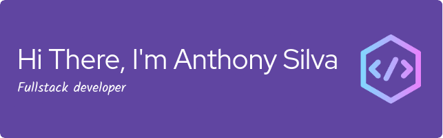

 

<h3 align="center">I'm a Full-Stack Developer with a background in chemistry. I'm a lover of the sciences and passionate about everything I do. I like to learn something new every day, which is why I'm always improving my skills.</h3>

## Technical Stack:

  
 
  
 
  
  
  
  
  
  
  

## Statistics

### Github Stats

### Top Languages

### Streak

## Find me:

